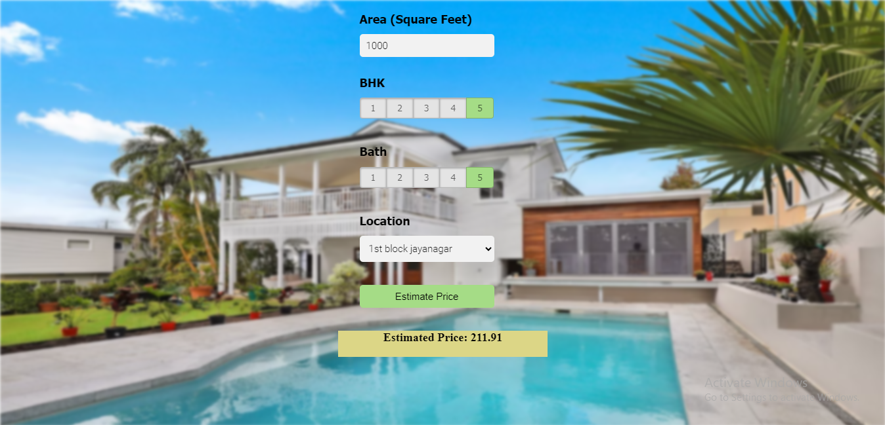

# House Price Prediction Project of Real Estate Company
This data science project series walks through the step-by-step process of building a real estate price prediction website. We will first build a model using sklearn and linear regression using the Banglore home prices dataset from kaggle.com. The second step would be to write a Python flask server that uses the saved model to serve HTTP requests. The third component is the website built in HTML, CSS, and JavaScript that allows users to enter the home square ft area, bedrooms, etc and it will call the Python flask server to retrieve the predicted price. During model building, we will cover almost all data science concepts such as data load and cleaning, outlier detection and removal, feature engineering, dimensionality reduction, GridsearchCV for hyperparameter tunning, k-fold cross-validation, etc. Technology and tools this project covers -
- Python
- Numpy and Pandas for data cleaning
- Matplotlib for data visualization
- Sklearn for model building
- Jupyter notebook, visual studio code and pycharm as IDE
- Python flask for HTTP server
- HTML/CSS/Javascript for UI

### Real-Time Web Application House Price Prediction

## Manage access to AWS resources
1. Create IAM users with - AmazonEC2ContainerRegistryFullAccess, AmazonEC2FullAccess
2. Go to inside user and click the Security Credentials then create an access key and download the CSV file

## Fully-managed Docker container registry: Share and deploy container software, publicly or privately
1. Go to Elastic Container Registry (ECR) and Create a new repository make sure it is private then copy the repo URL

## Virtual Servers in the Cloud
1. Go to EC2 then click Launch instance
- give the Name
- select start like ubuntu
- Instance type t2.mirco(free version)
- Key pair (login) you can make it the default value or select any previous 
- Network settings check to mark all Network
- Lunch Instance
- click on Instance ID
- click on Connect
- click on Connect

## Docker Setup In EC2 commands to be Executed
### Install optional
- sudo apt-get update -y
- sudo apt-get upgrade

# Install required
- curl -fsSL https://get.docker.com -o get-docker.sh
- sudo sh get-docker.sh
- sudo usermod -aG docker ubuntu
- newgrp docker

# Github
- go to project settings
- actions
- select runners
- select linux
- go to download and install step by step 
- go to configure install as well
- Enter the name of the runner group to add this runner to: [press Enter for Default] # here just press the Enter
- Enter the name of runner: [press Enter for ip-172-31-16-106] self-hosted
- ./run.sh
- go to secrets and variables
- add New secret keys which we donlowd as csv from AWS
- AWS_ACCESS_KEY_ID
- AWS_SECRET_ACCESS_KEY
- AWS_REGION = us-east-1
- AWS_ECR_LOGIN_URI = Remember 2nd step first one elastic container registry
